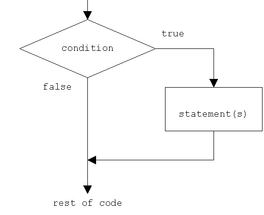
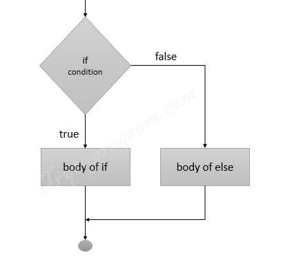
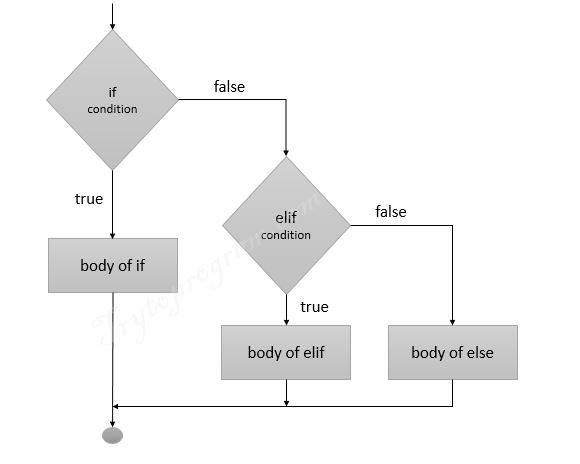
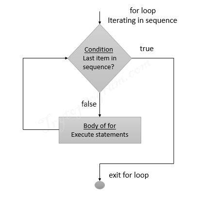
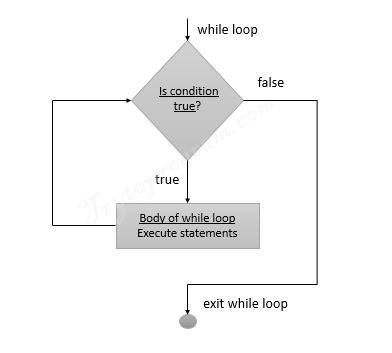
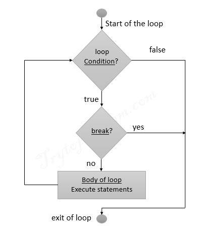
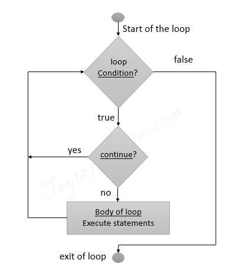

# Session - 3 

## if syntax

    if test expression:
        statement(s)

### if examples

    num = int(input("Enter a number: "))

    if num > 0:  # true condition
        print("positive")
    
    print("we are outside if and will always print")
### if 
    num = -1 
    
    if num > 0:
            print(f"number:{num} is positive")
    
    print("we are outside if and will always print")

## if else

    if test expression:
        statement(s) of if
    else:
        statement(s) of else

### if else examples
    num = -1 
    
    if num > 0:
        print(f"number:{num} is positive")
    else:
        print(f"number:{num} is negative")

## if elif else

    if test expression:
        statement(s) of if
    elif test expression:
        statement(s) of elif
    else:
        statement(s) of else

### if elif else examples
    num = -1 
    
    if num > 0:
        print(f"number:{num} is positive")
    elif num == 0:
        print(f"number:{num} is zero")
    else:
        print(f"number:{num} is negative")

### nested if statements

    if test expression:
        statement(s) of if
        if test expression:
            statement(s) of if
        else:
            statement(s) of else
    else:
        statement(s) of else

### nested if statements examples
    num = int(input("Enter a number please: "))
    
    if num > 0:
        if num == 0:
            print(f"number:{num} is one")
        else:
            print(f"number:{num} is positive")
    else:
        print(f"number:{num} is negative")

## Loops
#### _Loops are used to iterate over a sequence of items like list, tuple, string or other iterable items. Iterating over a sequence is known as looping or traversing._

## For Loop Syntax

    for item in iterable:
        statement(s)

here item is the variable name and iterable is the sequence of items.
for loop continues until the sequence is exhausted.

### for loop examples

    fruit_list = ['Apple','Mango','Guava','Pineapple']
    index = 0

    for fruit in fruit_list:
        print(f"at {index} the fruit is {fruit}")
        index += 1

#### Iterating over a Tuple
    tuple_list = ('Apple','Mango','Guava','Pineapple')
    index = 0

    for fruit in tuple_list:
        print(f"at {index} the fruit is {fruit}")
        index += 1

#### Iterating over a Dictionary
    dictionary = {'Apple':'Red','Mango':'Yellow','Guava':'Green','Pineapple':'Brown'}
    for key,value in dictionary.items():
        print(f"{key} is {value}")

#### Iterating over a string
    string = "Hello World"
    for char in string:
        print(char)

## Range function 

The range() is a built-in Python function used for iterating over a sequence of numbers.

    range(start, stop, step)

#### for loop and range( ) function examples
    for i in range(10):
        print(i)

## for-else loop

    for item in iterable:
        statement(s)
    else:
        statement(s)

## while loop

    while test expression:
        statement(s)

### while loop examples
    num = 0
    while num < 10:
        print(num)
        num += 1

## break and continue

    for item in iterable:
        if test expression:
            break
        statement(s)
    else:
        statement(s)

### break statement examples
    num = 0
    while num < 10:
        if num == 5:
            break
        print(num)
        num += 1

### continue statement examples
    num = 0
    while num < 10:
        if num == 5:
            continue
        print(num)
        num += 1

## Enumerate function

    enumerate(iterable, start=0)

In below example, Though you can use the index() function to get the index of an item in an iterable, the index() function only returns the index of the first occurrence of the item. For instance, in the nums list in the script below, the integer 20 occurs three times. If you try to print the index of the integer 20, you’ll only see the index of the first occurrence of 20, the index position 2.
    
    nums = [10,15,20,25,30,14,20,19,34,14,20,12]
    index_20 = nums.index(20)
    print(index_20)

With the enumerate() function, you can get indexes of all the items even if they occur multiple times in a list. The enumerate() function returns an object of “enumerate” type as shown in the output of the following script.

    print(list(enumerate(nums)))

OR

    nums = [10,15,20,25,30,14,20,19,34,14,20,12]
    
    for index,num in enumerate(nums):
        print(index,num)

## zip function

    zip(iterable1, iterable2)

The zip() function in Python is used to aggregate multiple iterables. The zip() function returns a list of tuples where each tuple contains the items from the matching indexes of the original iterables. This is best explained with an example.

    names = ["john", "nick", "sally", "Elizabeth", "Mike"]
    ages =  [20, 25, 35, 22, 29]
    genders = ["male", "male", "female", "female", "male"]
    
    records = list(zip(names, ages, genders))
    print(records)

In some cases, the iterables being aggregated, or combined, using the zip() function contain an unequal number of items. In such cases, only those items from multiple iterables are aggregated that correspond to the items in the smallest iterable.

    names = ["john", "nick", "sally", "Elizabeth", "Mike"]
    ages =  [20, 25, 35, 22, 29]
    genders = ["male", "male"]
    
    records = list(zip(names, ages, genders))
    print(records)

In these cases be mindful to use enumerate and zip together

    names = ["john", "nick", "sally", "Elizabeth", "Mike"]
    ages =  [20, 25, 35, 22, 29]
    genders = ["male", "male", "female", "female", "male"]
    
    
    for index, record in enumerate(zip(names, ages, genders)):
        print("Index=>", index," -Name=>", record[0], " -Age=>", record[1], " -Gender=>", record[2])

## Functions

Why we need them .?? 

Imagine you are developing an application in Python and you need to write a huge amount of code for it. In that application, you need to compare values and find the maximum value many times in the program.

Now if you write code to compare value and find maximum one at every need step in the program, the code will be too huge making it extremely difficult to manage and debug.

Thus to address this issue, we write our code and name them with a block of code. Thus making your code reusable and easy to manage.

    def function_name(parameters):
        statements
        return value

OR

    def function_name (arg 1, arg2,...):
      """docstring"""
      statement(s)
      return [expression]

To call the function we use the function name followed by the arguments.

    function_name(arg1, arg2,...)

#### Function Examples

    #return type function
    def add_r(a, b):
      """ return type function to find sum """
      x = a + b
      return x
    
    #non return type function
    def add_n(a, b):
      """ non return type function to return sum """
      x = a + b
      print (x)
    
    #call the return type function and print
    print (add_r(2,3))
    
    #call the non return type function
    add_n(2,3)
